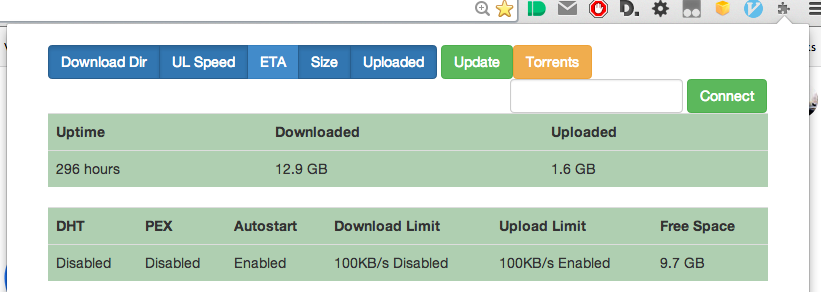

# Angular Chrome Extension for Transmission Daemon
### Using the [Official Spec](https://trac.transmissionbt.com/browser/trunk/extras/rpc-spec.txt)

#### Popout needs more styling 

#### I guess like 70% done.

Chrome extension which has a context menu which takes the torrent link, passes it to an angular service which GETs the torrent and encodes it into base64 which is then POSTed to the transmission-daemon

The popout consists of two pages, the torrent list and settings page. The torrent list has buttons to delete the torrent and data but aside from that it's not supposed to be a fully fledged client. Considering adding start/pause but I never use them on this.

The settings page shows statistics and also should have toggles (settings) for some of the stuff I use/care about.

The data is all there its mainly just styling the setting page left.

